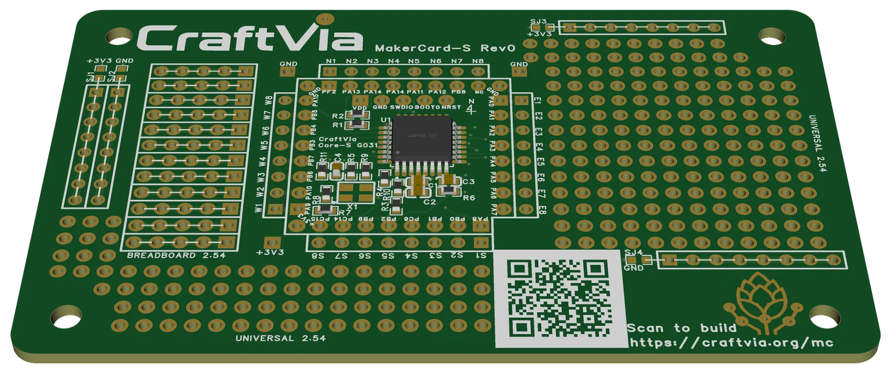

# CraftVia MakerCard-S

> [!WARNING]
> **Unverified Rev 0 hardware**  
> The Rev 0 boards have been ordered and are awaiting delivery. They have not yet been assembled, powered, or electrically verified. Manufacturing or assembly is at your own risk.

[日本語](README.ja.md) · [CraftVia](https://craftvia.org) · [Rev 0 release notes](RELEASE_NOTES.md)

[Rev 0 specification](docs/specification-v1-rev0.md) · [Rev 0 verification plan](docs/verification-plan-v1-rev0.md) · [Common CraftVia documentation](https://github.com/craftvia/craftvia-docs)



*Rev0 CAD rendering — [front view](docs/images/makercard-s-v1-rev0-front.webp) · [back view](docs/images/makercard-s-v1-rev0-back.webp). Renderings are illustrative; the frozen design source and Gerber package are authoritative.*

CraftVia MakerCard-S is a reference implementation for moving a Core-S-class MCU circuit into a practical prototyping format. It combines the Core-S G031 circuit with breakout, prototype-field, and power-rail areas suitable for one-off devices, fixtures, and early application prototypes.

MakerCard-S demonstrates an implementation path between Station-based development and a fully custom Carrier or integrated MCU PCB.

## Current status

| Item | Status |
| --- | --- |
| Product generation | v1 |
| PCB revision | Rev0 |
| Fabrication | Boards ordered; awaiting delivery |
| Assembly | Not started |
| Power-on test | Not started |
| Electrical verification | Not started |
| Release tag | `v1-rev0` planned |

## Rev 0 summary

- Board outline: 91.0 mm × 55.0 mm
- PCB: 4 layers
- Four 3.2 mm NPTH mounting holes
- Integrated STM32G031K8T6 Core-S circuit
- Core-S breakout and prototype-field connections
- Configurable prototype power rails via SJ1-SJ4
- Default clock: internal HSI; external oscillator option is DNP
- CAD source: EasyEDA

## Repository layout

```text
source/                      Authoritative editable EasyEDA sources
fabrication/                 Canonical Gerber package
assembly/                    BOM, CPL, and assembly reference
docs/                        Schematic PDF and product documentation
product.json                 Machine-readable public product metadata
RELEASE_NOTES.md             Detailed Rev 0 notes and first-article checks
SHA256SUMS.txt               Integrity manifest
```

## Critical Rev 0 conditions

Read the complete [`v1-rev0` release notes](RELEASE_NOTES.md) before ordering or assembling boards.

- The Gerber ZIP is the sole PCB fabrication master.
- The exported CPL is unfiltered and must be reconciled against the authoritative BOM before turnkey assembly.
- J1-J7 are through-hole headers and generally require THT service or manual assembly.
- Header dimensions and the intended Core-S/Station-S mechanical stack must be confirmed.
- SJ1-SJ4 must remain open until the intended prototype power-rail connection is understood and verified.
- The schematic PDF contains historical draft labels and is not the manufacturing master.

## Maker profile and distribution

The back of MakerCard-S is designed as a maker-profile area. The board is intended not only for prototyping, but also as a physical project introduction that can be shared as a business card at events, demonstrations, workshops, and personal meetings.

The Rev 0 reference artwork contains the public maker information of Kohei Ikeda as an example of the intended use of the profile area. Before manufacturing or distributing a personalized MakerCard-S, replace the back-side profile text with your own information. The reference QR code links to [CraftVia.org](https://craftvia.org) and may be retained; it does not need to be replaced when personalizing the profile.

The intended customization is primarily the back-side profile, but the front-side layout and circuitry may also be modified under the applicable hardware license. Modified boards must still follow the CraftVia Trademark Policy and must not be presented as official CraftVia products.

The inclusion of a person's name or profile information does not grant permission to impersonate that person or imply their endorsement.

## First-article validation

Initial validation will cover outline and mounting holes, prototype-field continuity and isolation, rail-link defaults, header orientation, current-limited power-up, rail voltage and current, SWD, BOOT behavior, and breakout mappings. Results will be published without moving the `v1-rev0` tag. Design changes require a new revision.

## License and brand

Hardware design files in this repository are licensed under [CERN-OHL-P-2.0](LICENSE), unless a file-specific notice says otherwise. See [CraftVia Licensing](LICENSES/README.md) for category boundaries and attribution guidance.

The CraftVia name and logos are owned by Kohei Ikeda and are not licensed under the hardware license. See the [CraftVia Trademark Policy](LICENSES/TRADEMARK_POLICY.md). Modified or third-party-manufactured hardware must not be presented as an official CraftVia product.
